

  <h1>Do IT TOgether (DITTO)</h1>
  
🎨 DIY 온라인 취미 클래스 및 공유 플랫폼 🎨

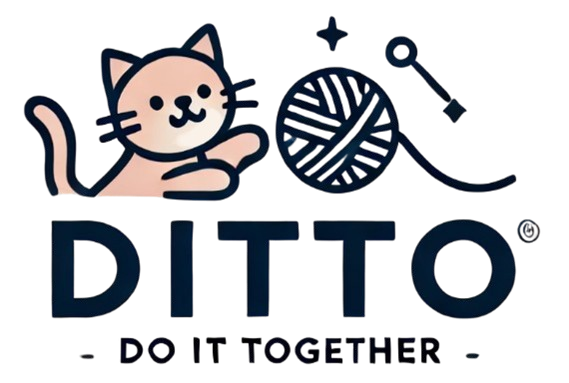
 

> 서비스 바로가기   > **https://i11a106.p.ssafy.io**

 

  <a href="https://i11a106.p.ssafy.io/">홈페이지 </a>
  &nbsp; | &nbsp; 
  <a href="http://i11a106.p.ssafy.io:8080/swagger-ui/index.html#/">Swagger </a>
  &nbsp; | &nbsp; 
  <a href="https://ssafy.atlassian.net/jira/software/c/projects/S11P12A106/boards/6974">Jira </a>
  &nbsp; | &nbsp; 
  <a href="https://ssafy-11th-a106-project.notion.site/">Notion </a>
  &nbsp; | &nbsp; 
  <a href="https://docs.google.com/document/d/1ximw-0fHCp1mF3r4-ubYZ6C6keAJdscZ/edit?usp=sharing&ouid=109929827104996211729&rtpof=true&sd=true">기획서 </a>

 

## ✍️ 프로젝트 개요

- **프로젝트 명:** Do IT TOgether (DITTO)
- **프로젝트 기간:** 2023.07.01 ~ 2023.08.16
- **SSAFY 11기 2학기 공통 프로젝트**
- **👑SSAFY 공통 프로젝트 우수상 수상👑**

## ✍️ 프로젝트 소개

### 프로젝트 배경

최근 몇 년간 소비 트렌드가 변화하며 새로운 경험을 공유하는 것이 핵심 요소로 자리잡았습니다. 특히 취미 생활은 사람들의 일상 속에서 중요한 부분이 되었고, 취미에 투자하는 소비자들이 증가하고 있습니다. 엔데믹 이후에도 지속적인 성장을 보여주는 온라인 취미 플랫폼들은 이러한 현상을 잘 보여줍니다. 하지만 기존의 플랫폼들은 사용자 간 경험 공유의 부족함으로 인해 진정한 소통의 기회를 놓치고 있습니다.

Do IT TOgether (DITTO)는 이러한 문제점을 해결하고, 혼자서도 취미를 즐기고 싶은 사람들이 시공간의 제약 없이 DIY 취미를 배울 수 있는 온라인 플랫폼을 제공합니다.

---

## 🚀 프로젝트 목표

- **DIY 온라인 취미 클래스 제공:** 다양한 DIY 취미를 온라인에서 배울 수 있는 환경을 제공.
- **경험 공유의 장 마련:** 유저 간 소통과 취미 공유를 강화하여 커뮤니티 활성화.
- **강사의 수익 창출 기회 제공:** 취미 지식을 공유하면서 수익을 얻을 수 있는 기회를 제공.

---

## 📊 기대 효과

### 플랫폼
- **경험 공유 DIY 플랫폼의 등장:** 커뮤니티화 및 실시간 양방향 소통을 통한 공유의 결여 해결.

### 수강생
- **유연한 학습 환경:** 시간과 공간의 제약 없이 다양한 DIY 취미를 배우고 공유 가능.
- **커뮤니티 상호작용:** 비슷한 관심사를 가진 사람들과 연결되어 상호작용하며 취미 생활 가능.

### 강사
- **수익 창출 기회:** 자신의 취미를 공유하고, 유연하게 수익을 창출할 수 있는 기회 제공.

---

## 📌 주요 기능

- **실시간 화상 강의 기능:** 수강생들이 집에서도 편리하게 취미를 배울 수 있으며, 학습 상태를 실시간으로 표시할 수 있습니다.
- **실시간 채팅 기능:** 강의 중 실시간 채팅을 통해 활발한 소통이 가능하며, 단체 채팅 및 비공개 채팅 모두 지원.
- **음성 인식 자막 및 요약 기능:** 강의 중 음성을 실시간으로 텍스트로 변환하여 제공, 강의 후 요약본 제공.
- **취미 클래스 검색 기능:** 다양한 강의를 쉽게 검색할 수 있는 기능 제공.
- **프로필 검색 및 팔로우 기능:** 관심 있는 강사나 수강생과의 네트워크 형성 가능.
- **커뮤니티 기능:** 게시판을 통해 취미 생활을 공유하거나 모임을 모집할 수 있는 기능 제공.

---

## 👥 주요 고객

- **강사:** 자신의 취미를 온라인으로 쉽게 가르치고, 수익을 창출하려는 사람들.
- **수강생:** 시공간의 제약 없이 다양한 취미를 배우고자 하는 사람들.

---

## 🧑‍💻 팀원 소개

| **이서빈** | **김규태** | **권재현** | **임세하** | **조서영** |
|:----------:|:----------:|:----------:|:----------:|:----------:|
| 팀장, BE  | 팀원, BE  | 팀원, BE  | 팀원, FE  | 팀원, FE  |
| 클래스, 리뷰, Q&A, 결제, CI/CD | 게시판, 댓글, 프로필, AI, WebRTC, 발표 | 로그인, 회원가입, 마이페이지 | 클래스, 리뷰, Q&A, 결제, UCC | 게시판, 댓글, 프로필, WebRTC, 채팅 |

---

## ⚙️ 기술 스택

<table>
    <thead>
        <tr>
            <th>분류</th>
            <th>기술 스택</th>
        </tr>
    </thead>
    <tbody>
        <tr>
            <td>
                  
프론트엔드

            </td>
            <td>
                  
                  
            </td>
        </tr>
        <tr>
            <td>
                
백엔드

            </td>
            <td>
                
                
                
            </td>
        </tr>
        <tr>
            <td>
                
인프라

            </td>
            <td>
                
                
                
                
            </td>
        </tr>
        <tr>
            <td>
                
협업 툴

            </td>
            <td>
                
                
                
                
                
            </td>
        </tr>
    </tbody>
</table>

---

## 📽️ 주요 기능 시연 GIF

### 회원가입, 로그인, 카카오 로그인

### 게시글 관련 기능
- **게시글 등록**  
  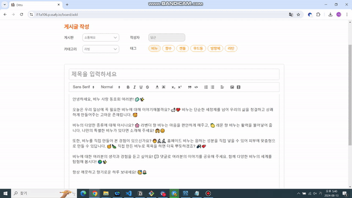

- **게시글 상세**  
  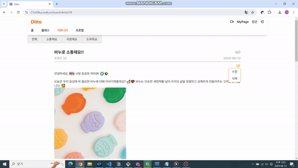

- **게시글 수정**  
  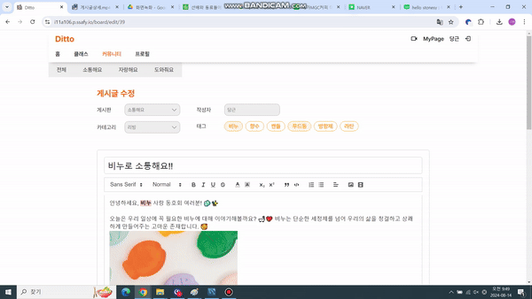

- **게시글 수정 및 삭제**  
  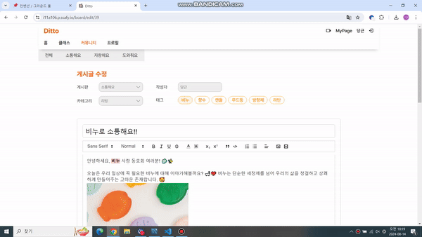

- **게시판 목록 및 검색**  
  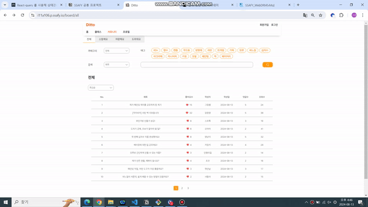

### 마이페이지 관련 기능
- **프로필 사진 및 닉네임 변경**  
  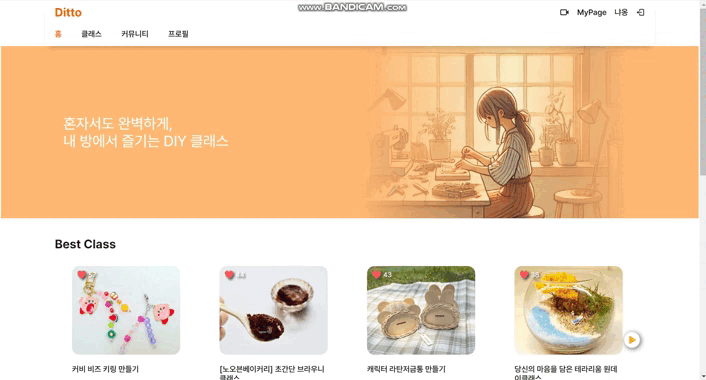

- **계정 정보 및 배송지 등록**  
  

- **결제 취소, 요약 보기, 리뷰 작성 및 수정**  
  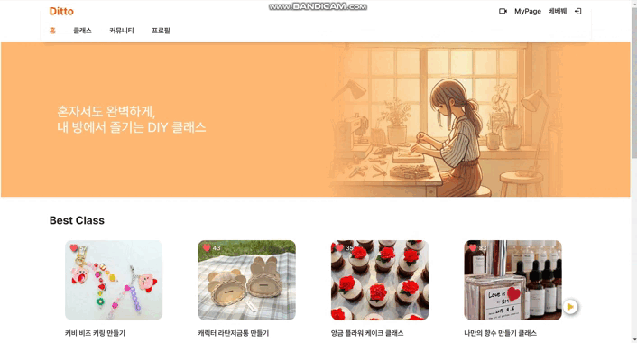

- **관심 목록**  
  

- **작성한 문의**  
  

### 프로필 관련 기능
- **나의 프로필**  
  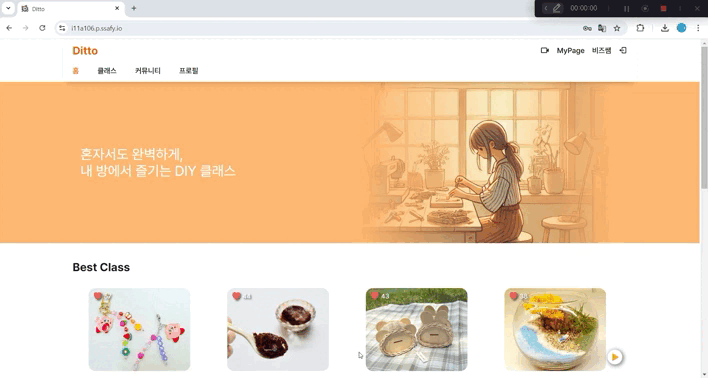

- **다른 사용자의 프로필**  
  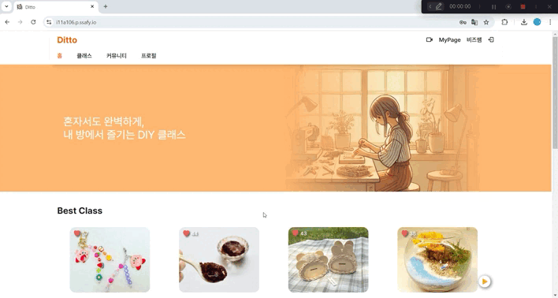

- **프로필 검색**  
  

### 클래스 관련 기능
- **클래스 등록**  
  

- **클래스 리스트 조회**  
  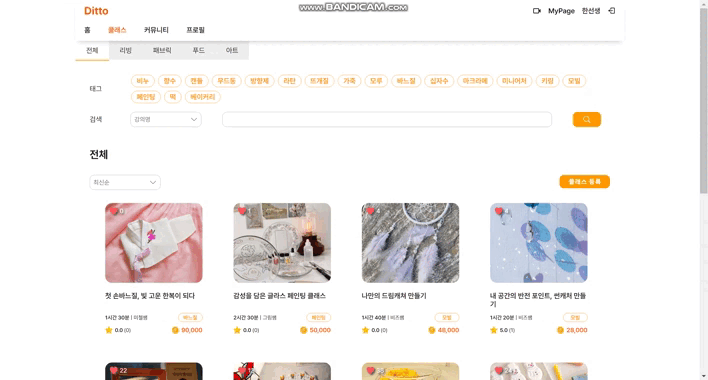

- **클래스 리뷰 및 문의**  
  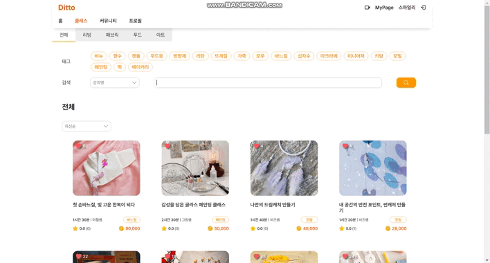

### 수강생 프로세스

---

## 🔨 시스템 아키텍처

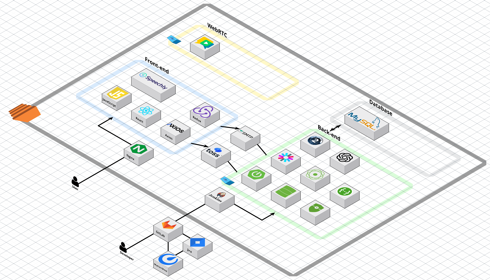

---

## 📊 ERD

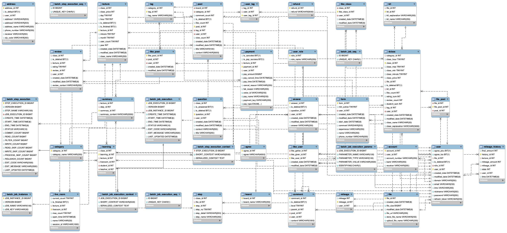

---

## 🌐 유튜브 링크

[{: width="100px" height="40px"}](https://youtu.be/ejzWzqgtO0M)

---
